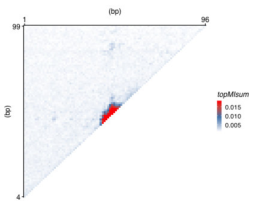
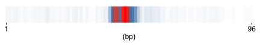

# Mutual Infomation Calculation for SELEX
<br><br><br>

* [Introduction](#intro)
* [Prerequisite](#prereq)
* [Input data](#input)
* [Calculate mutual infomation](#calc)
* [Visualization](#plot)
  + [2D plot](#map2d)
  + [1D plot](#map1d)

-----------------------------

<a name="intro"></a>

## Introduction

To footprint the binding of transcription factors on DNA, the traditional motif mapping analysis requires previously curated motifs, and is limited to profile only 1 motif at a time. To overcome such issues, this package provides the implementation of the mutual-infomation based footprint analysis for transcription factors. 

Check also <https://www.nature.com/articles/s41586-018-0549-5> for details on how to use.
<br><br>
<a name="prereq"></a>

## Prerequisit
To use the functions in this package. Please note that the package **fjComm** needs to be installed before hand. There is an `install_github` function to install R packages hosted on GitHub in the **devtools** package. It requests developer’s name.:


```r
install_github("aquaflakes/fjComm")
```
<br><br>
<a name="input"></a>

## Input data requirement
The input data needs to be stored in a dataframe with only 1 column, each row corresponds to one sequence from the illumina sequencing. The data frame look like follows:

```
##                                      .
## 1 ACTACTATCTATTCTATCATTACTACTACATATCAT
## 2 ACTACTATCTATTCTATCATTACTACTACATATCAT
## 3 ACTACTATCTATTCTATCATTACTACTACATATCAT
## 4 ACTACTATCTATTCTATCATTACTACTACATATCAT
## 5 ACTACTATCTATTCTATCATTACTACTACATATCAT
```
<br><br>
<a name="calc"></a>

## Calculate Mutual Infomation

Use the following command to perform calculation of the mutual infomation and generate a data frame, only the first few rows were displayed :

```r
df= ic_related_calc (input_seq, kmerLen=2L, filter_for_spacing=TRUE, spacing=0, verbose=F, pseudo=10L, type="maxBias", maxBias_dimer_Params=list(type="topMI",topNo=5L) ) 
```
The generated data frame contains 6 columns

```
## # A tibble: 6 x 6
##    pos1  pos2 topMIsum bottomMIsum topk1 topk2
##   <dbl> <dbl>    <dbl>       <dbl> <chr> <chr>
## 1     1     4  0.00247   -0.00142  TAA   CGC  
## 2     1     5  0.00234   -0.00106  CAC   CTC  
## 3     1     6  0.00220   -0.000986 AAA   GCC  
## 4     1     7  0.00176   -0.000991 CTA   CGA  
## 5     1     8  0.00173   -0.00105  CCC   CCC  
## 6     1     9  0.00176   -0.000937 TAA   CTA
```
<br><br>
<a name="plot"></a>

## Plots to Visualize Mutual Infomation
This package also provides ready-made functions to aid the visualization of necessary infomations. There are two basic way to visualize the data:<br><br>
<a name="map2d"></a>

> 2D Heat Map for All Positional Combinations

To visualize all infomation contained in the dataframe, we can plot a 2-dimensional heatmap. This provide a quick overview for the whole dataset.

```r
fjComm::gg_heat2D_MI(df, grad_colors = fjComm::gg_steelblue_red)
```

<!-- -->
<br><br><br>

<a name="map1d"></a>

> 1D Heat Map for Neighbouring Positions 

As TFs in general do not bind across a large span of DNA. For most of the cases, the mutual infomation between the neighbouring positions are the strongest. Therefore, most infomations are already contained by visualizing the diagnal of the 2D plot.

```r
fjComm::gg_heat2D_diag(df, grad_colors = fjComm::gg_steelblue_red)
```

<!-- -->

------------
**For more instructions about individual functions, please read the help documents under<br> <https://github.com/aquaflakes/MutualInfo/man>**<br>
Fangjie Zhu<br>
2020-02-18
